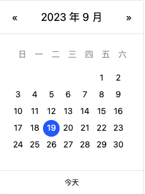
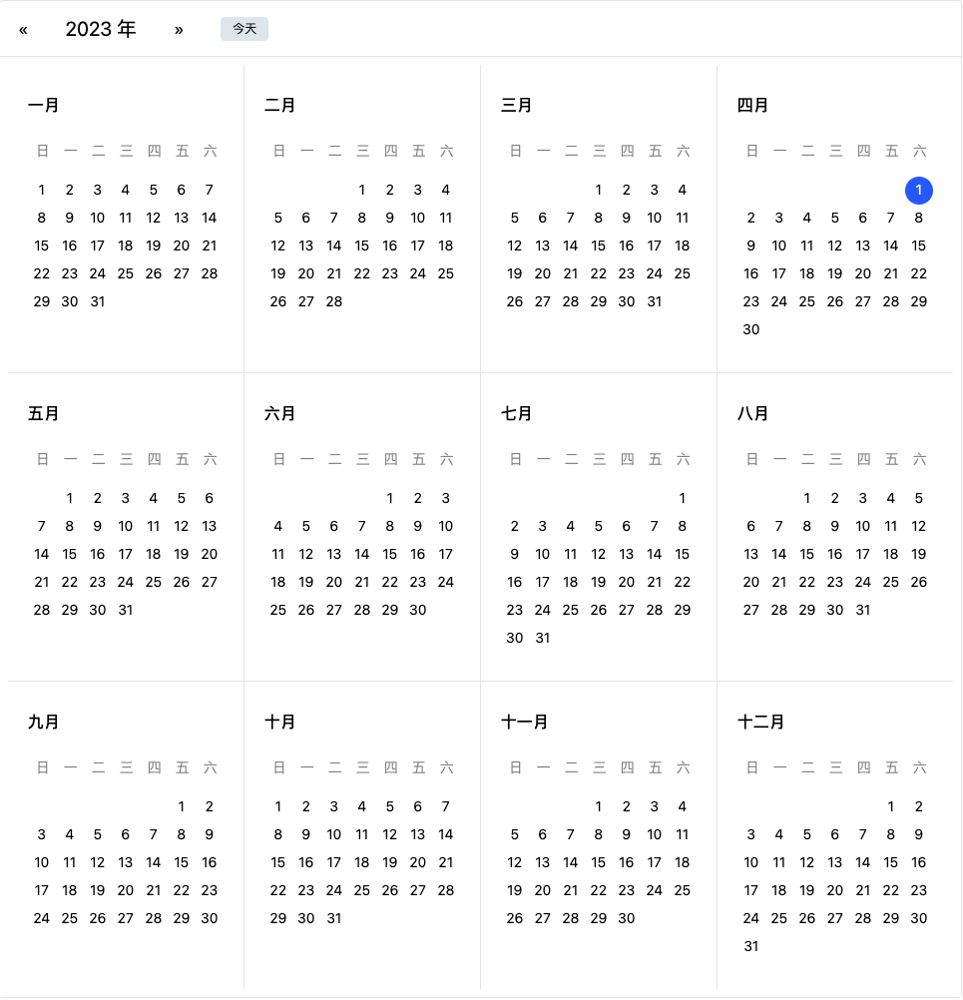

## MT-UI

MT-UI 是一个自建的 UI 组件库，主要是自己实际工作中的需求提炼出来的，希望通过一套组件覆盖 B + C 端项目需求，降低开发门槛。

本框架无其它组件库依赖，项目会持续维护，并且在代码中增加必要注释让前端同学学习制作思路，增加代码的可读性。

本框架基于 React18 + Sass + [Tailwindcss](https://tailwindcss.com/docs/letter-spacing#setting-the-letter-spacing) + TS + [Vite](https://cn.vitejs.dev/guide/using-plugins) + Locale 本地化 + Jest 实现。

## 背景

我几年前曾今发布过 [全日历组件](https://github.com/VagrantDaniel/RFCalendar)，技术日新月异，目前 React 已经到 18 版本，hooks 写法可以很好的提升代码复用性和可维护性；并且随着这几年工作发现了之前组件开发的各种问题，从 0 到 1 比较简单，但从 1 到 100 需要不断的优化才能慢慢提升，铁棒磨成针，有时候必须下笨功夫才行。

## 有哪些组件
- 日历组件  





## 启动项目

1. 安装依赖
```
npm install
```

2. 启动
```
npm run dev
```

3. 测试
```
npm run test
```
