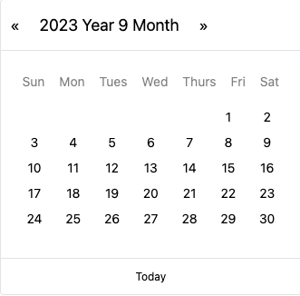
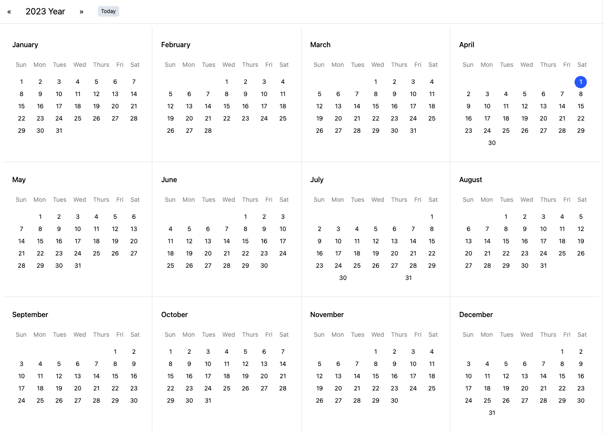

## MT-UI

MT-UI is a self-built UI component library, which is mainly extracted from the needs of my actual work. It is hoped that a set of components can cover the needs of B + C-side projects and lower the development threshold.

This framework has no dependencies on other component libraries. The project will be continuously maintained, and necessary comments will be added to the code to allow front-end students to learn production ideas and increase the readability of the code.

This framework is implemented based on React18 + Sass + [Tailwindcss](https://tailwindcss.com/docs/letter-spacing#setting-the-letter-spacing) + TS + [Vite](https://cn.vitejs.dev/guide/using-plugins) +  Locale localization + Jest.

## Background
I released a [full calendar component](https://github.com/VagrantDaniel/RFCalendar) a few years ago. Technology is changing with each passing day. Currently, React has reached version 18. The hooks writing method can greatly improve code reusability and maintainability; and with the work of the past few years, I have discovered the previous component development For various problems, going from 0 to 1 is relatively simple, but going from 1 to 100 requires continuous optimization to slowly improve. An iron rod is ground into a needle, and sometimes you have to work hard.

## What are the components
- calendar component  





## Startup project

1. install CLI
```
npm install @onpure/pack-cli -g
```

2. install dependencies
```
lerna bootstrap && lerna add mt-ui --dev
```

3. start up
```
npm run docs:dev
```

